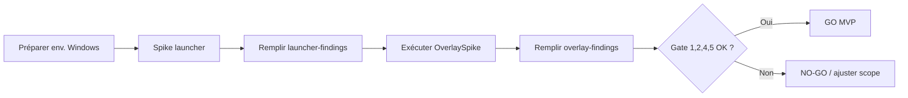

# Phase 0 — Spike technique (Wave 0)

Avant l'implémentation du MVP, cette phase valide les inconnues critiques identifiées dans la [spec de design](../superpowers/specs/2025-06-22-paradow-sync-design.md#12-phase-0--technical-spike-pre-implementation). Durée cible : **1–2 jours**, exécution **séquentielle et bloquante**.

## Objectifs

| # | Question | Méthode | Critère de passage |
|---|----------|---------|-------------------|
| 1 | Le launcher Ankama peut-il lancer N instances Dofus Unity ? | Test manuel + script | 4 clients concurrents |
| 2 | L'invocation du launcher est-elle scriptable ? | CLI, API Zaap, raccourcis | Lancement programmatique par compte |
| 3 | L'écran de sélection de personnage est-il accessible en UI Automation ? | Accessibility Insights | Nœuds identifiables pour clic |
| 4 | Les overlays layered fonctionnent-ils sur Dofus Unity ? | Prototype Win32 [`OverlaySpike`](../../spike/OverlaySpike) | Visible + click-through |
| 5 | Le hook de focus est-il fiable ? | `SetWinEventHook` dans OverlaySpike | Détection < 50 ms |

## Gate MVP

L'implémentation MVP **ne démarre** qu'après validation des critères **1, 2, 4 et 5**.

| Critère | Si échec |
|---------|----------|
| 1–2 (launcher) | Bloquant — revoir intégration orchestrateur |
| 3 (UI Automation) | Non bloquant pour le gate — auto-sélection perso en MVP ou fallback manuel |
| 4 (overlay) | Fallback : bandeau d'équipe hors fenêtre de jeu |
| 5 (focus) | Bloquant — hotkeys et indicateur actif dépendent du hook |

## Livrables

| Fichier | Contenu |
|---------|---------|
| [2025-06-22-launcher-findings.md](./2025-06-22-launcher-findings.md) | Résultats launcher + UI Automation |
| [2025-06-22-overlay-findings.md](./2025-06-22-overlay-findings.md) | Résultats overlay + latence focus |
| [`spike/OverlaySpike`](../../spike/OverlaySpike) | Prototype console Win32 exécutable sur Windows |

## Déroulement

1. **Environnement** — Machine Windows avec Zaap, ≥ 4 comptes, Dofus Unity, .NET 8 SDK.
2. **Launcher** — Suivre le template [launcher-findings](./2025-06-22-launcher-findings.md) ; documenter invocation et arbre UI Automation.
3. **Overlay** — Builder et lancer OverlaySpike sur Windows ; mesurer visibilité et latence.
4. **Synthèse** — Renseigner les sections go/no-go des deux rapports ; le coordinateur tranche le gate.

## Contraintes

- Aucun mot de passe ni secret dans les documents ou logs de spike.
- Pas de code production dans `src/` — uniquement `spike/` et `docs/spike/`.
- Tests réels jeu / launcher sur **Windows** (le coordinateur WSL ne peut pas exécuter le prototype overlay).

## Références

- [Design spec complète](../superpowers/specs/2025-06-22-paradow-sync-design.md)
- [OverlaySpike — build & run](../../spike/OverlaySpike/README.md)
